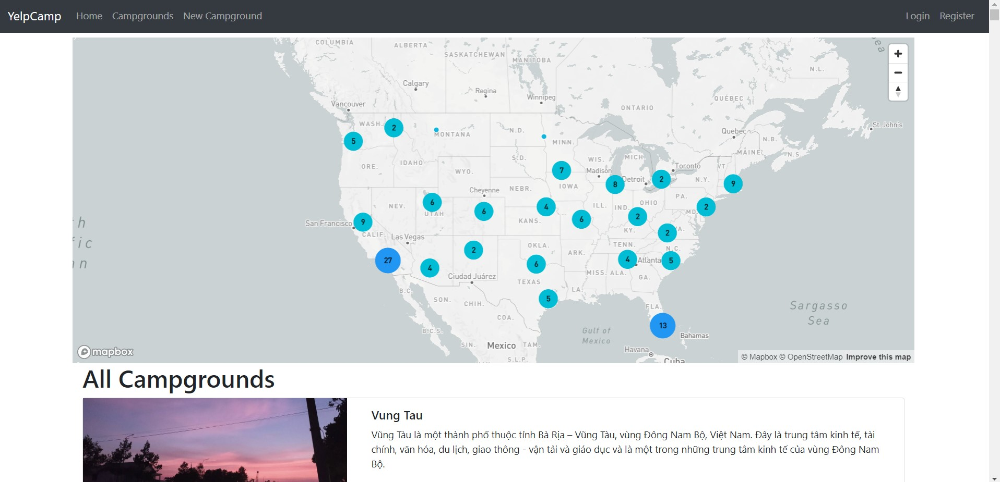

# Yelp Camp Web Application

This web application allows users to add, view, access, and rate campgrounds by location. It is based on "The Web Developer Bootcamp" by Colt Steele, but includes several modifications and bug fixes. The application leverages a variety of technologies and packages, such as:

- **Node.js with Express**: Used for the web server.
- **Bootstrap**: For front-end design.
- **Mapbox**: Provides a fancy cluster map.
- **MongoDB Atlas**: Serves as the database.
- **Passport package with local strategy**: For authentication and authorization.
- **Cloudinary**: Used for cloud-based image storage.
- **Helmet**: Enhances application security.
- ...

## Setup Instructions

To get this application up and running, you'll need to set up accounts with Cloudinary, Mapbox, and MongoDB Atlas. Once these are set up, create a `.env` file in the same folder as `app.js`. This file should contain the following configurations:

```sh
CLOUDINARY_CLOUD_NAME=[Your Cloudinary Cloud Name]
CLOUDINARY_KEY=[Your Cloudinary Key]
CLOUDINARY_SECRET=[Your Cloudinary Secret]
MAPBOX_TOKEN=[Your Mapbox Token]
DB_URL=[Your MongoDB Atlas Connection URL]
SECRET=[Your Chosen Secret Key] # This can be any value you prefer
```

After configuring the .env file, you can start the project by running:
```sh
docker compose up
```

## Application Screenshots




# 3-Tier Full Stack Project

## Project Overview
This project demonstrates a comprehensive 3-tier full stack application deployment using Azure DevOps for CI/CD, Docker for containerization, and Amazon EKS for orchestration. The application is built with Node.js, and it leverages Cloudinary for image storage, Mapbox for mapping, and MongoDB Atlas for database management. The project includes a robust deployment pipeline, static code analysis, and security scanning.

## Installation
To get started with the project, clone the repository and follow the steps below:

```sh
git clone <repository_url>
cd <repository_directory>
```

## Setting Up Azure DevOps

### Create a New Project
1. Go to Azure DevOps.
2. Create a new project.
3. Set up a new pipeline and connect it to your GitHub repository.

### Pipeline Configuration
1. Navigate to Pipelines > Create Pipeline.
2. Select your repository and configure the pipeline using the classic editor

## Installing Docker
Docker Installation Script

```sh
#!/bin/bash
# Update package manager repositories
sudo apt-get update
# Install necessary dependencies
sudo apt-get install -y ca-certificates curl
# Create directory for Docker GPG key
sudo install -m 0755 -d /etc/apt/keyrings
# Download Docker's GPG key
sudo curl -fsSL https://download.docker.com/linux/ubuntu/gpg -o /etc/apt/keyrings/docker.asc
# Ensure proper permissions for the key
sudo chmod a+r /etc/apt/keyrings/docker.asc
# Add Docker repository to Apt sources
echo "deb [arch=$(dpkg --print-architecture) signed-by=/etc/apt/keyrings/docker.asc] https://download.docker.com/linux/ubuntu $(. /etc/os-release && echo "$VERSION_CODENAME") stable" | sudo tee /etc/apt/sources.list.d/docker.list > /dev/null
# Update package manager repositories
sudo apt-get update
# Install Docker
sudo apt-get install -y docker-ce docker-ce-cli containerd.io docker-buildx-plugin docker-compose-plugin
# Allow Docker to be run without sudo
sudo chmod 666 /var/run/docker.sock
```

## Setting Up SonarQube
1. Ensure Docker is installed using the script above.
2. Run the following command to start SonarQube:
``sh
docker run -d --name sonar -p 9000:9000 sonarqube:lts-community
```

## Setting Up EKS

AWS CLI Installation
``sh
curl "https://awscli.amazonaws.com/awscli-exe-linux-x86_64.zip" -o "awscliv2.zip"
sudo apt install unzip
unzip awscliv2.zip
sudo ./aws/install
aws configure
```

kubectl Installation
``sh
curl -o kubectl https://amazon-eks.s3.us-west-2.amazonaws.com/1.19.6/2021-01-05/bin/linux/amd64/kubectl
chmod +x ./kubectl
sudo mv ./kubectl /usr/local/bin
kubectl version --short --client
```
eksctl Installation
``sh
curl --silent --location "https://github.com/weaveworks/eksctl/releases/latest/download/eksctl_$(uname -s)_amd64.tar.gz" | tar xz -C /tmp
sudo mv /tmp/eksctl /usr/local/bin
eksctl version
```

## Creating EKS Cluster
```sh
eksctl create cluster --name=my-eks22 --region=ap-south-1 --zones=ap-south-1a,ap-south-1b --without-nodegroup
eksctl utils associate-iam-oidc-provider --region ap-south-1 --cluster my-eks22 --approve
eksctl create nodegroup --cluster=my-eks22 --region=ap-south-1 --name=node2 --node-type=t3.medium --nodes=3 --nodes-min=2 --nodes-max=4 --node-volume-size=20 --ssh-access --ssh-public-key=Key --managed --asg-access --external-dns-access --full-ecr-access --appmesh-access --alb-ingress-access
```

## Local Execution
Connect to the machine using ssh-key in Mobaxterm:
1. Clone the repository:
``sh
git clone <repository_url>
cd <repository_directory>
```

2. Install Node.js using NVM:
```sh
curl -o- https://raw.githubusercontent.com/nvm-sh/nvm/v0.39.7/install.sh | bash
export NVM_DIR="$HOME/.nvm"
[ -s "$NVM_DIR/nvm.sh" ] && \. "$NVM_DIR/nvm.sh" # This loads nvm
[ -s "$NVM_DIR/bash_completion" ] && \. "$NVM_DIR/bash_completion"
nvm install 20
node -v # should print `v20.12.2`
npm -v # should print `10.5.0`
```

3. Obtain API keys from Cloudinary, Mapbox, and MongoDB Atlas.
4. Create a .env file and add the following lines with your actual values:
``sh
CLOUDINARY_CLOUD_NAME=[Your Cloudinary Cloud Name]
CLOUDINARY_KEY=[Your Cloudinary Key]
CLOUDINARY_SECRET=[Your Cloudinary Secret]
MAPBOX_TOKEN=[Your Mapbox Token]
DB_URL=[Your MongoDB Atlas Connection URL]
SECRET=[Your Chosen Secret Key]
```

5. Install project dependencies:
```sh
npm install
```

6. Start the application:
```sh
npm start
```

7. Access the app at http://VM_IP:3000 (replace VM_IP with the IP address of your Ubuntu machine).

## Dev Deployment Pipeline

### Azure DevOps Pipeline Configuration
```sh
trigger:
- main

pool:
  vmImage: 'ubuntu-latest'

variables:
  SCANNER_HOME: '/usr/share/sonar-scanner'

steps:
- task: NodeTool@0
  inputs:
    versionSpec: '20.x'
  displayName: 'Install Node.js'

- script: npm install
  displayName: 'Install Package Dependencies'

- script: npm test
  displayName: 'Run Unit Tests'

- script: trivy fs --format table -o fs-report.html .
  displayName: 'Run Trivy FS Scan'

- task: SonarQubePrepare@5
  inputs:
    SonarQube: 'sonar'
    scannerMode: 'CLI'
    configMode: 'manual'
    cliProjectKey: 'Campground'
    cliProjectName: 'Campground'

- task: SonarQubeAnalyze@5
  displayName: 'Run SonarQube Analysis'

- script: |
    docker build -t adijaiswal/camp:latest .
    docker push adijaiswal/camp:latest
  displayName: 'Build and Push Docker Image'

- script: trivy image --format table -o fs-report.html adijaiswal/camp:latest
  displayName: 'Run Trivy Image Scan'

- script: |
    docker run -d -p 3000:3000 adijaiswal/camp:latest
  displayName: 'Deploy Docker Image Locally'
```

## Production Deployment Pipeline
### Azure DevOps Pipeline Configuration
```sh
trigger:
- main

pool:
  vmImage: 'ubuntu-latest'

variables:
  SCANNER_HOME: '/usr/share/sonar-scanner'

steps:
- task: NodeTool@0
  inputs:
    versionSpec: '20.x'
  displayName: 'Install Node.js'

- script: npm install
  displayName: 'Install Package Dependencies'

- script: npm test
  displayName: 'Run Unit Tests'

- script: trivy fs --format table -o fs-report.html .
  displayName: 'Run Trivy FS Scan'

- task: SonarQubePrepare@5
  inputs:
    SonarQube: 'sonar'
    scannerMode: 'CLI'
    configMode: 'manual'
    cliProjectKey: 'Campground'
    cliProjectName: 'Campground'

- task: SonarQubeAnalyze@5
  displayName: 'Run SonarQube Analysis'

- script: |
    docker build -t adijaiswal/campa:latest .
    docker push adijaiswal/campa:latest
  displayName: 'Build and Push Docker Image'

- script: trivy image --format table -o fs-report.html adijaiswal/campa:latest
  displayName: 'Run Trivy Image Scan'

- script: |
    kubectl apply -f Manifests/
    sleep 60
  displayName: 'Deploy to EKS'

- script: |
    kubectl get pods -n webapps
    kubectl get svc -n webapps
  displayName: 'Verify Deployment'
```

## Environment Variables
Ensure you have the following environment variables configured in your .env file:

```sh
CLOUDINARY_CLOUD_NAME=[Your Cloudinary Cloud Name]
CLOUDINARY_KEY=[Your Cloudinary Key]
CLOUDINARY_SECRET=[Your Cloudinary Secret]
MAPBOX_TOKEN=[Your Mapbox Token]
DB_URL=[Your MongoDB Atlas Connection URL]
SECRET=[Your Chosen Secret Key]
```
License
This project is licensed under the MIT License. See the LICENSE file for details.

Feel free to contribute to the project by forking the repository and submitting pull requests. For any issues or feature requests, please open an issue in the repository.

